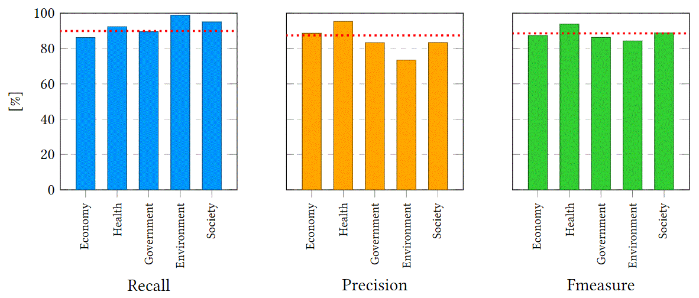

# Complements of the expriment results
Here we show the experimental results in the article by applying other algorithms:

## Feature Category Effectiveness (%)

| ML Algorithm  | Metric | GE | ST | IC | GE+ST | GE+IC | ST+IC | ALL |
| ------------- | ------------- | ------------- | ------------- | ------------- | ------------- | ------------- | ------------- | ------------- |
| | Recall | 92.20 | 93.96 | 88.89 | 94.07 | 92.86 | 93.70 | **94.77** |
| SVM | Precision | 74.45 | 76.80 | 75.47 | 76.85 | 76.90 | 76.71 | **78.44** |
| | F-measure | 82.32 | 84.35 | 81.63 | 84.45 | 84.47 | 84.23 | **85.76** |
|  |  |  |  |  |  |  |  |  |
| | Recall | 89.05 | 89.16 | 89.16| 89.97 | 85.63 | 89.12 | 91.20 |
| DT | Precision | 78.53 | 86.24 | 79.64 | 89.22 | 84.80 | 87.15 | **89.17** |
| | F-measure | 83.29 | 87.59 | 85.39 | 89.55 | 85.11 | 88.07 | **90.12** |
|  |  |  |  |  |  |  |  |  |
|  | Recall | 84.13 | 91.95 | 92.07 | 85.56 | 92.57 | 92.08 | 90.16 |
| KNN | Precision | 83.73 | 82.45 | 81.48 | 86.06 | 84.14 | 83.65 | 87.61 |
|  | F-measure | 83.82 | 86.90 | 86.42 | 85.68 | 88.11 | 87.59 | 88.78 |

## Model Generality

* ### Results of apllying svm:

<strong>Result of testing on single source by applying svm</strong>

<strong>Result of testing on single domain by applying svm</strong>

* ### Results of apllying decision tree:

<strong>Result of testing on single source by applying decision tree</strong>

<strong>Result of testing on single domain by applying decision tree</strong>

* ### Results of apllying knn:

<strong>Result of testing on single source by applying knn</strong>

<strong>Result of testing on single domain by applying knn</strong>

